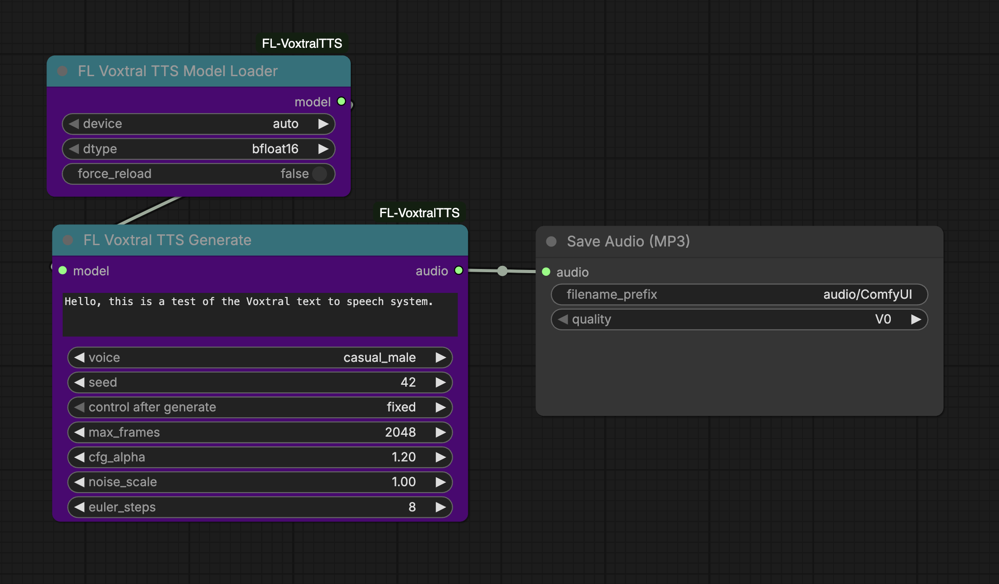

# FL Voxtral TTS

ComfyUI nodes for Mistral's Voxtral-4B text-to-speech model with direct PyTorch inference. Supports 20 preset voices across 9 languages on CUDA, MPS, and CPU.

[](https://huggingface.co/mistralai/Voxtral-4B-TTS-2603)
[](https://www.patreon.com/Machinedelusions)



## Features

- **Direct PyTorch Inference** - Full local TTS pipeline, no external servers required
- **20 Preset Voices** - Male and female voices across 9 languages
- **Flow Matching** - Modern generative architecture for high-quality 24 kHz audio
- **Tunable Generation** - Exposed CFG, noise scale, and Euler step parameters
- **Reproducible Output** - Seed control for deterministic generation
- **Cross-Platform** - CUDA, Apple MPS, and CPU support with automatic device detection

## Nodes

| Node | Description |
|------|-------------|
| **Model Loader** | Downloads and caches the Voxtral-4B model from HuggingFace with configurable device and dtype |
| **Generate** | Synthesize speech from text with voice selection and generation parameters |

## Installation

### ComfyUI Manager
Search for "FL Voxtral TTS" and install.

### Manual
```bash
cd ComfyUI/custom_nodes
git clone https://github.com/filliptm/ComfyUI-FL-VoxtralTTS.git
cd ComfyUI-FL-VoxtralTTS
pip install -r requirements.txt
```

## Quick Start

1. Add **FL Voxtral TTS Model Loader** and select your device/dtype
2. Connect to **FL Voxtral TTS Generate**
3. Enter your text, pick a voice, and queue the prompt
4. Connect the audio output to a **Save Audio** node

## Models

| Model | Parameters | Output |
|-------|------------|--------|
| Voxtral-4B-TTS-2603 | 4B | 24 kHz mono audio |

The model downloads automatically on first use to `ComfyUI/models/tts/VoxtralTTS/`.

## Voices

| Voice | Language | Gender |
|-------|----------|--------|
| casual_female | English | Female |
| casual_male | English | Male |
| cheerful_female | English | Female |
| neutral_female | English | Female |
| neutral_male | English | Male |
| fr_female | French | Female |
| fr_male | French | Male |
| es_female | Spanish | Female |
| es_male | Spanish | Male |
| de_female | German | Female |
| de_male | German | Male |
| it_female | Italian | Female |
| it_male | Italian | Male |
| pt_female | Portuguese | Female |
| pt_male | Portuguese | Male |
| nl_female | Dutch | Female |
| nl_male | Dutch | Male |
| ar_male | Arabic | Male |
| hi_female | Hindi | Female |
| hi_male | Hindi | Male |

## Generation Parameters

| Parameter | Default | Range | Description |
|-----------|---------|-------|-------------|
| cfg_alpha | 1.2 | 0.0 - 3.0 | Classifier-free guidance strength for voice consistency |
| noise_scale | 1.0 | 0.0 - 2.0 | Initial noise magnitude for flow matching |
| euler_steps | 8 | 2 - 32 | Euler ODE solver steps (higher = better quality, slower) |
| max_frames | 2048 | 128 - 4096 | Maximum audio frames to generate |
| seed | -1 | -1+ | Random seed for reproducibility (-1 for random) |

## Requirements

- Python 3.9+
- 16GB RAM minimum
- NVIDIA GPU with 12GB+ VRAM recommended (CPU and Mac MPS supported)

## License

Apache 2.0
